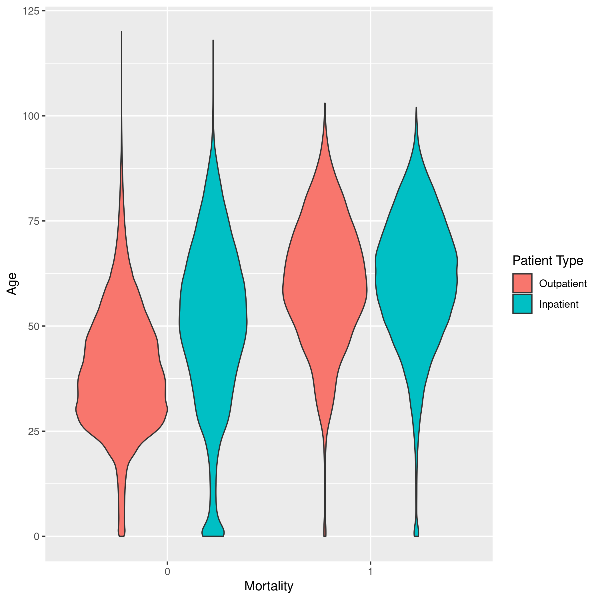
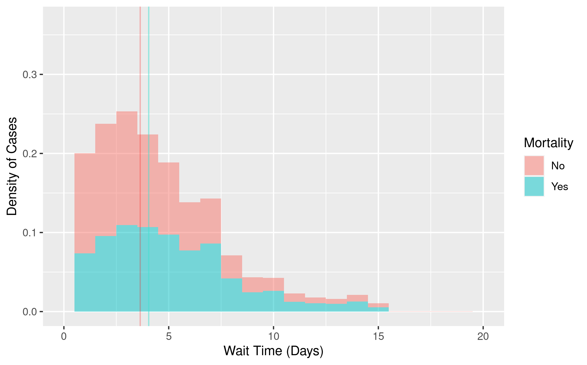
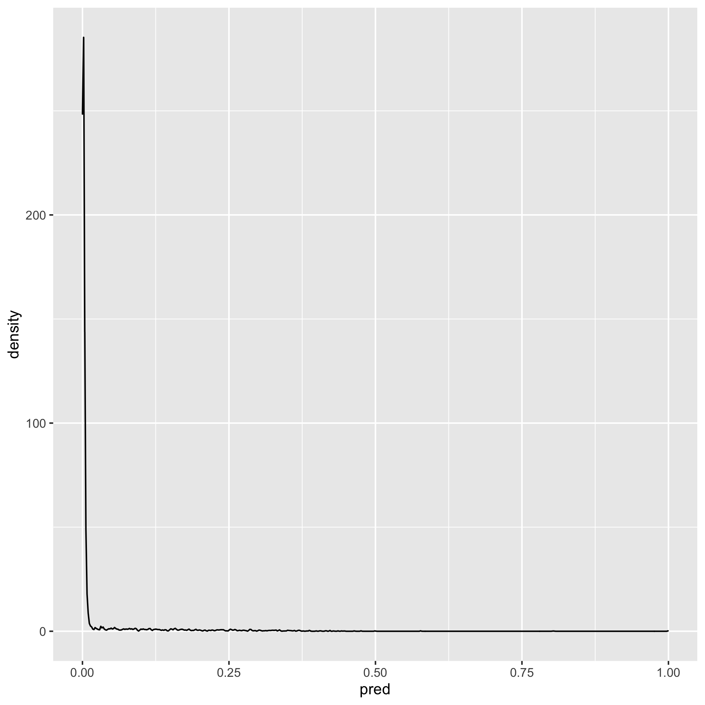
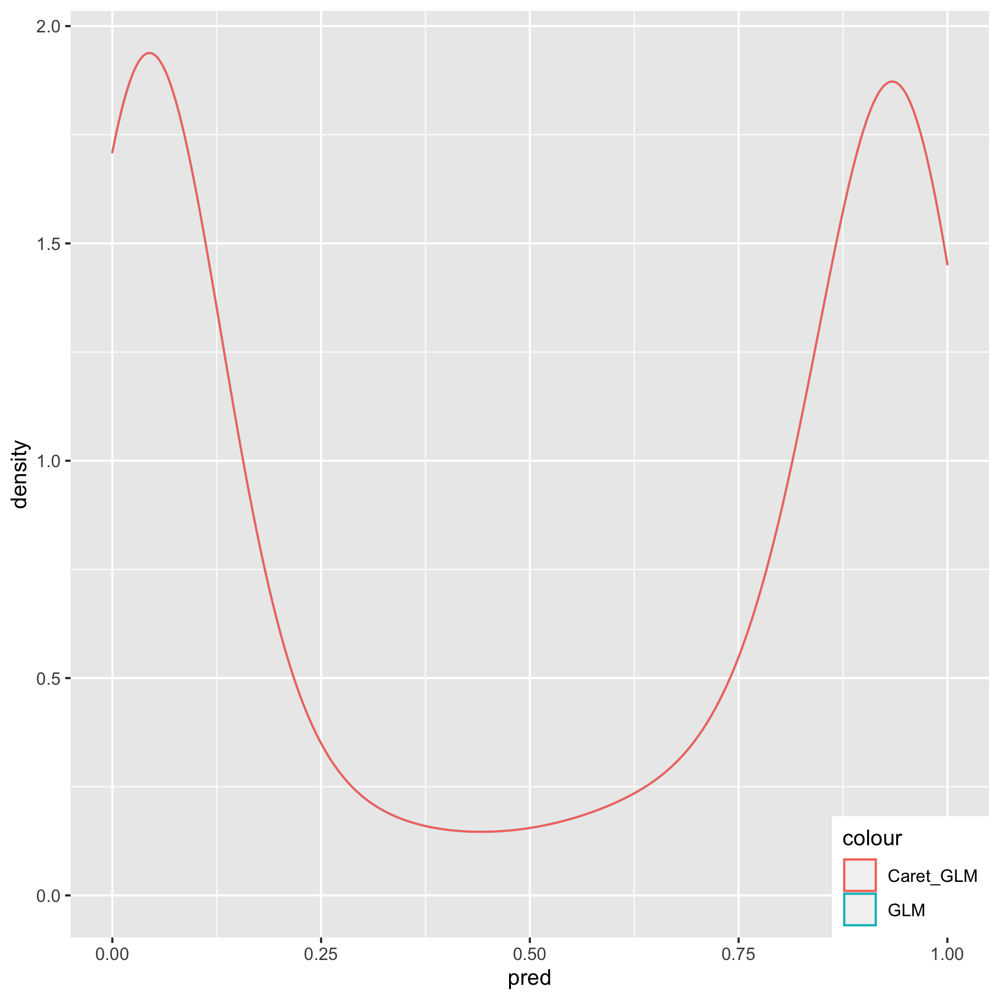

Bios 611 - Project 1
====================
  COVID-19 Analysis
------------------

This text is an example of the report that will generate after following the code instructions below.

### Introduction
  
  The coronavirus pandemic is a result of the coronavirus disease (COVID-19) caused by the severe acute respiratory syndrome coronavirus 2 (SARS-CoV-2), an RNA virus that has affected the lives of many individuals since its discovery late in 2019. 

There has been approximately 40 million reported cases of COVID-19 globally, with around 8.2 million of these cases located in the United States. Due to its potential for severe symptoms in affected individuals, the virus has been a subject of close study.

While we realize that the severity of symptoms can be different in each individual, we would like to better understand the possible causes for these variations. Using publicly available datasets, this project will try to find associations between patient pre-conditions or other characteristics and their susceptibility to the disease, which we will define as whether the patient later was registered as deceased. 

We are interested in knowing whether gender, certain chronic illnesses, behaviors such as smoking, or contact with COVID-19 affected individuals resulted in greater patient risk to severe symptoms of the disease, as well as whether different types of treatment (ICU, in/out-patient) influenced health outcomes. 

Descriptive statistics will take an initial look at some of these effects, and classification methods (logistic regression, trees) will deeper analyze what type of individuals are at a higher risk for more severe COVID-19 symptoms. A possible criteria for completion is building a model that can successfully predict whether an individual, given a list of pre-conditions or characteristics, is at lower or greater risk if affected by COVID-19.

### Datasets

The dataset contains observations of patients from Mexico, and can be found on [Kaggle](https://www.kaggle.com/tanmoyx/covid19-patient-precondition-dataset#) ("Kaggle" is a hyperlink to the dataset). Potentially important variables we will analyze for addressing our questions include "patient_type", which describes whether the patient was given in-patient or out-patient care; date_symptoms, entry_date, and date_died for when a patient started showing symptoms, the day they were sought treatment, and if they later died from the disease, as well as chronic illness conditions such as diabetes, hypertension, etc. 
                                                                                        
Two descriptive Excel files called "Description" and "Catalogs" contain the former variable names and instructions for interpretation of numeric values: For yes/no responses, the catalog describes yes as 1, no as 2, NA as 97, question ignored as 98, and not specified as 99. For gender, 1 is female and 2 is male, and 99 is not specified. Positive SARS-CoV-2 cases are labeled as 2. These files can be found in the source_data folder on the git repository. We will be working on the subset of all positive SARS-CoV-2 cases for this report.
                                                                                        
### Preliminary Figures


                                                                                          
As seen in the violin graph above, where 0 represents an alive patient, older patients are more likely to be sent to the hospital for in-patient care. This is reflected in older individuals also seeming to be the largest proportion of mortality cases at the hospital. 

There is greater variation in age between in-patient and out-patient care for patients who are living at the time of the data collection than those who have died, showing that although older patients are more likely to be sent to the hospital for in-patient care, treatment type might not be predictive of mortality. Overall, it appears that older populations are more at risk for mortality due to the disease, and we will look for a similar trend in our models. 
                                                                                        


                                                                                          
The above graph shows how patients who wait longer to be treated for the disease might have a similar mortality rate to those who received treatment earlier. The wait time variable was calculated by finding the number of days between the patient's admit date to the care unit and the day their first symptoms began. Patients who died on average seem to have waited longer for treatment, but this pattern is most likely not statistically significant. 
                                                                                        
Because many of the precondition variables are dichotomous, we will visualize them with logistic classification models in the next section.
                         
### Modelling 

Since the size of the data is relatively large (around 280,000 observations), we will randomly sample 20,000 observations from the original dataset and set a seed of 1 for reproducibility. We first try to visualize the effects of potential covariates with a gradient boosting machine to get an initial view of the influential variables predicting patient death from COVID-19. 

Before we run a gbm model, we remove certain variables that might cause collinearity between the explanatory variables such as patient_type (intensive care unit (icu) is in-patient care) and pregnancy (men will respond with no or NA). Based on the relative influence table below, we see that icu, age, contact_other_covid, renal_chronic, and diabetes are the most influential variables for training the gradient boosting models. This indicates that whether a patient was required to enter the intensive care unit, differences in age, interaction with others diagnosed with the disease, chronic kidney failure, and diabetes were influential variables in fitting the models, and we should look for these covariates in our further analysis with a more interpretable logistic model. 


```{r comment=''}
cat(readLines('figures/bm.txt'), sep = '\n')
```

From the logistic regression model summary, we can see that the results corroborate what we have found in the gbm model: icu, age, and contact_other_covid are statistically significant variables in the model along with gender at the alpha = 0.05 level, while diabetes and renal_chronic are almost significant at the alpha = 0.10 level. The prediction accuracy is 0.975, which can be seen in the prediction density plot below; the model predicts that most patients will live, possibly because deceased cases are relatively few in number (around 1/50 observed patients). This might hint that we are working with a class imbalance, which we will try to address with cross validation or resampling using the caret package on an equally sampled subset of the data, where 3000 observations are each 0 and 1 for mortality. 


```{r comment=''}
cat(readLines('figures/lm.txt'), sep = '\n')
```



The second logistic model is mathematically defined the same way as above, in addition to 50 fold cross validation on an equally sampled set. In this logistic model, our statistically significant parameters at the 0.05 level remain relatively the same, with age, gender, diabetes, renal_chronic, inmsupr, contact_other_covid, and icu status being significant in predicting mortality. Prediction accuracy is 0.90875, which is adequate due to the class imbalance being addressed as seen in the prediction density plot. Additionally, the predictions from the cross validation and glm logistic models overlap: 



As described in the summary below, for all other variables held constant, we can conclude that for a baseline of female the log odds of mortality increases by approximately 0.518 for males. The log odds increases by 0.0389 for every increase in age by year of the patient. For the baseline of having diabetes or chronic kidney disease, no diabetes results in a -0.4121 log odds decrease in mortality and no kidney disease results in a -0.912 log odds decrease in mortality, and not entering the icu results in a -1.887 log odds decrease, or -5.481 log odds decrease if entering the icu is not applicable. Not being immunosuppressed resulted in a -1.201 log odds decrease in mortality. The coefficients corresponding to not entering the icu are negatively correlated with mortality, because individuals without severe symptoms usually do not require intensive care. Surprisingly, not having or no specified contact with someone with a diagnosed COVID-19 case resulted in a 1.016 or 1.987 increase in log odds respectively, and is possibly due to a lack of knowledge of potential cases around the patient resulting in a higher risk of mortality. 

```{r comment=''}
cat(readLines('figures/glmFit1.txt'), sep = '\n')
```

From our analysis of the COVID-19 data, we conclude that pre-existing health conditions and other characteristics of individuals can be significant in predicting whether severe symptoms of SARS-CoV-2 could occur, of which include gender, age, diabetes, chronic kidney failure, and immunosuppression. We also found that contact tracing can be helpful in reducing risk of mortality within positive individuals, as the lack of knowledge of interacting with positive case individuals resulted in higher mortality rates. 

Therefore, our statistical models can predict whether someone with certain characteristics or pre-conditions are more likely to experience more severe symptoms of COVID-19 such as mortality. Further work in studying a different dependent variable as a severe symptom, improving accuracy of methods for reducing class imbalance and finding clusters of subpopulations susceptible to the disease can also be further areas of study one could consider.                                              


Using this Project
-----------------

You will need Docker, and be able to run docker as your current user.

To build the container: 

    > docker build . -t project1-env
    
This Docker container is based on rocker/verse. Run rstudio server:
    
    > docker run -v `pwd`:/home/rstudio -p 8787:8787 -e PASSWORD=<yourpassword> -t project1-env
      
then connect to the machine on port 8787.


Building a PDF for Project
------------------------------
You will need Docker, and be able to run docker as your current user.

To build the container: 

    > docker build . -t project1-env
    
This Docker container is based on rocker/verse. 

After connecting to the docker environment, you will need to be able to run the terminal on the computer. Due to large data sizes, we will be creating the report through the computer terminal to avoid encountering data allocation errors when generating the pdf.

In the computer terminal, load R and select the local US CRAN mirror. Then install packages located in the Dockerfile (if any dependencies need to be installed, select yes):

    > R 
    > install.packages('tidyverse')
    > install.packages('readr')
    > install.packages('kernlab')
    > install.packages('gbm')
    > install.packages('e1071')
    > install.packages('caret')

After the packages have been installed, exit R and save workspace image: 

    > quit()
    > y

Then in the same terminal: 

    > make clean; make report.pdf
    
The report.knit.md and report.pdf will generate, and the file can be opened with:

    > open report.pdf

