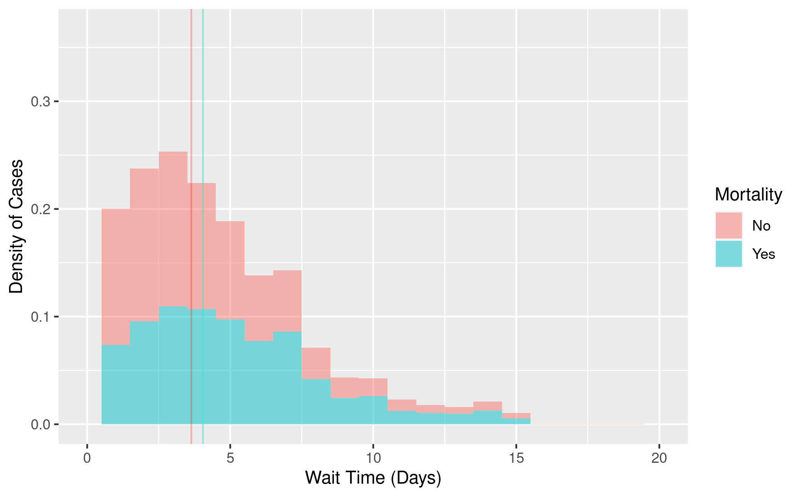
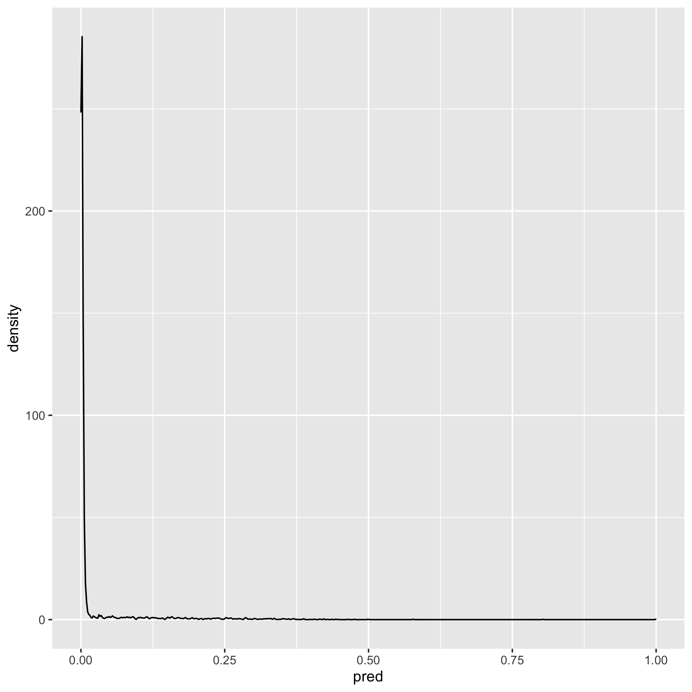
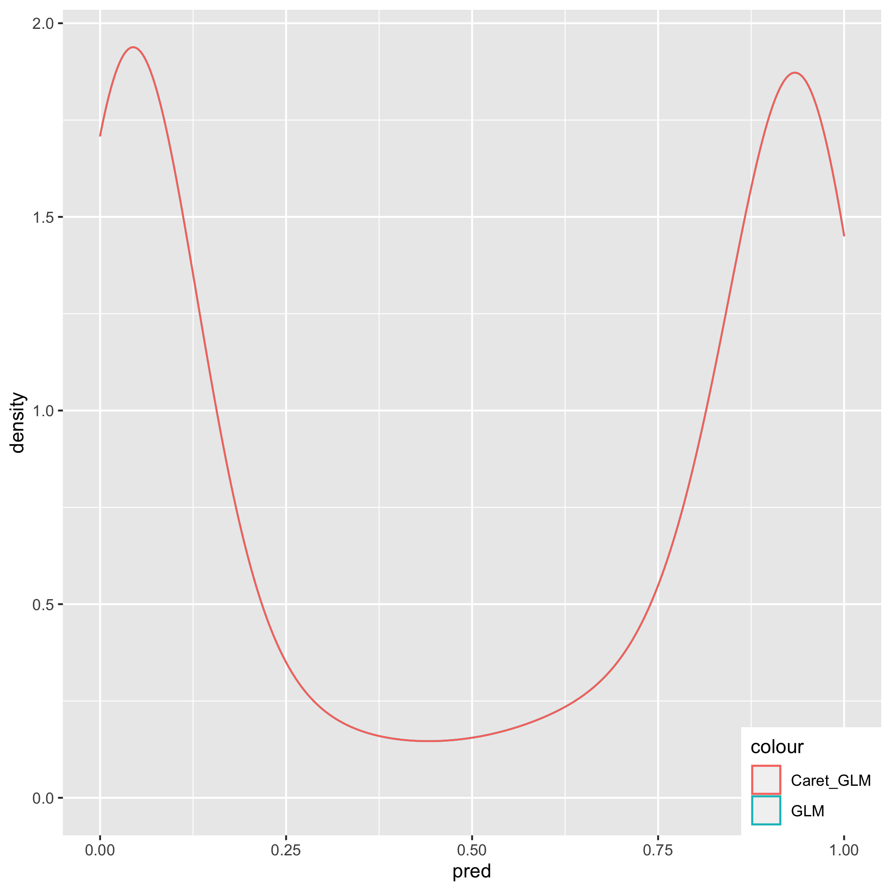

Bios 611 - Project 1
====================
  COVID-19 Analysis
------------------
  Proposal
--------
### Introduction
  
  The coronavirus pandemic is a result of the coronavirus disease (COVID-19) caused by the severe acute respiratory syndrome coronavirus 2 (SARS-CoV-2), an RNA virus that has affected the lives of many individuals since its discovery late in 2019. 

There has been approximately 40 million reported cases of COVID-19 globally, with around 8.2 million of these cases located in the United States. Due to its potential for severe symptoms in affected individuals, the virus has been a subject of close study.

While we realize that the severity of symptoms can be different in each individual, we would like to better understand the possible causes for these variations. Using publicly available datasets, this project will try to find associations between patient pre-conditions or other characteristics and their susceptibility to the disease, which we will define as whether the patient later was registered as deceased. 

We are interested in knowing whether gender, certain chronic illnesses, behaviors such as smoking, or contact with COVID-19 affected individuals resulted in greater patient risk to severe symptoms of the disease, as well as whether different types of treatment (ICU, in/outpatient) influenced health outcomes. 

Descriptive statistics will take an initial look at some of these effects, and classification methods (logistic regression, trees) will deeper analyze what type of individuals are at a higher risk for more severe COVID-19 symptoms. A possible criteria for completion is building a model that can successfully predict whether an individual, given a list of pre-conditions or characteristics, is at lower or greater risk if affected by COVID-19.

### Datasets

The dataset contains observations of patients from Mexico, and can be found on [Kaggle](https://www.kaggle.com/tanmoyx/covid19-patient-precondition-dataset#). Potentially important variables to analyze for addressing our questions include "patient_type", which describes whether the patient was given inpatient or outpatient care; date_symptoms, entry_date, and date_died for when a patient started showing symptoms, the day they were sought treatment, and if they later died from the disease, as well as chronic illness conditions such as diabetes, hypertension, etc. 
                                                                                        
Two descriptive Excel files called "Description" and "Catalogs" contain the former variable names and instructions for interpretation of numeric values. For yes/no answers, the catalog describes yes as 1, no as 2, NA as 97, ignored as 98, and not specified as 99. For gender, 1 is female and 2 is male, and 99 is not specified. Positive SARS-CoV-2 cases are labeled as 2. We will be working on the subset of all positive SARS-CoV-2 cases for this report.
                                                                                        
### Preliminary Figures


                                                                                          
As seen in the violin graph above, where 0 represents an alive patient, older patients are more likely to be sent to the hospital for inpatient care. This is reflected in older individuals also seeming to be the largest proportion of mortality cases at the hospital. Overall, older populations are more at risk for mortality due to the disease. 
                                                                                        


                                                                                          
The above graph shows how patients who wait longer to be treated for the disease might have a similar mortality rate to those who received treatment earlier. There seems to be a slight difference, but is most likely not statistically significant. 
                                                                                        
Because many of the precondition variables are dichotomous, we will visualize them with logistic classification models. 
                         
### Modelling 

Since the size of the data is relatively large (around 280,000 observations), we will randomly sample 20,000 observations from the original dataset and set a seed of 1 for reproducibility. We will first try to visualize the effects of potential covariates with a gradient boosting machine, to get an initial view of the influential variables for predicting patient death from covid-19. 

Based on the relative influence table below, we see that icu, age, contact_other_covid, chronic kidney failure, and diabetes are the most influential variables for training the gradient boosting models. The prediction accuracy on a validate set is 0.97575. This indicates that whether a patient was required to enter the intensive care unit, differences in age, interaction with others diagnosed with the disease, kidney failure, and diabetes were influential variables in fitting the models, and we should look for these covariates in our further analysis with a more interpretable logistic model. 

```{r, echo=FALSE}
system("cat figures/bm.txt")
```

From the logistic regression model summary, we can see that the results corroborate those found in the gbm model: icu, age, contact_other_covid, and diabetes are statistically significant variables in the model at the alpha = 0.05 level. The prediction accuracy is 0.975, which can be seen in the prediction density plot; the plot shows that the model predicts that most patients will live, possibly because deceased cases are relatively few in number (1/50 observed patients). This might hint that we are working with a class imbalance, which we will try to address with cross validation or resampling using the caret package. The prediction density plot is shown below. 

```{r, echo=FALSE}
system("cat figures/lm.txt")
```



In our final logistic model, our statistically significant parameters at the 0.05 level remain relatively the same, with age, gender, diabetes, contact_other_covid, and icu status being significant in predicting mortality. The class imbalance still can be seen, but the prediction density shows a slightly more balanced distribution. 



As seen in the summary below, for all other variables held constant, we can conclude that for a baseline of female the log odds of mortality increases by approximately 0.3226 for males. The log odds increases by 0.02659 for every increase in year of the patient. For the baseline of having diabetes, no diabetes results in a -0.3561 log odds decrease in mortality, and not entering the icu results in a -1.041 log odds decrease, or -4.511 log odds decrease if entering the icu is not applicable. The coefficients corresponding to not entering the icu are negatively correlated with mortality, because individuals without severe symptoms usually do not require intensive care. Suprisingly, not having contact with someone with diagnosed COVID-19 case resulted in a 0.08333 increase in log odds, and is possibly due to unawareness of potential cases around the patient resulting in a higher risk of mortality. 

```{r, echo=FALSE}
system("cat figures/caret_lm.txt")
```

From our analysis of the Kaggle data, we conclude that pre-existing health conditions and other characteristics of individuals can be significant in predicting whether severe symptoms of SARS-CoV-2 could occur, of which include gender, age, diabetes, and potentially kidney failure. We also found that contact tracing can be helpful in reducing risk of mortality within positive individuals. Further work in reducing class imbalance in the dependent variable and finding clusters of subpopulations susceptible to the disease can also be considered.                                                                   

Using this Project
-----------------

You will need Docker, and be able to run docker as your current user.

To build the container: 

    > docker build . -t project1-env
    
This Docker container is based on rocker/verse. Run rstudio server:
    
    > docker run -v `pwd`:/home/rstudio -p 8787:8787 -e PASSWORD=<yourpassword> -t project1-env
      
then connect to the machine on port 8787.


Building a PDF for this Project
------------------------------

After connecting to port 8787, you will need the Makefile, and be able to run the Terminal. 

In the Terminal: 

    > make clean; make report.pdf
    
and the report will generate in a separate tab. 
